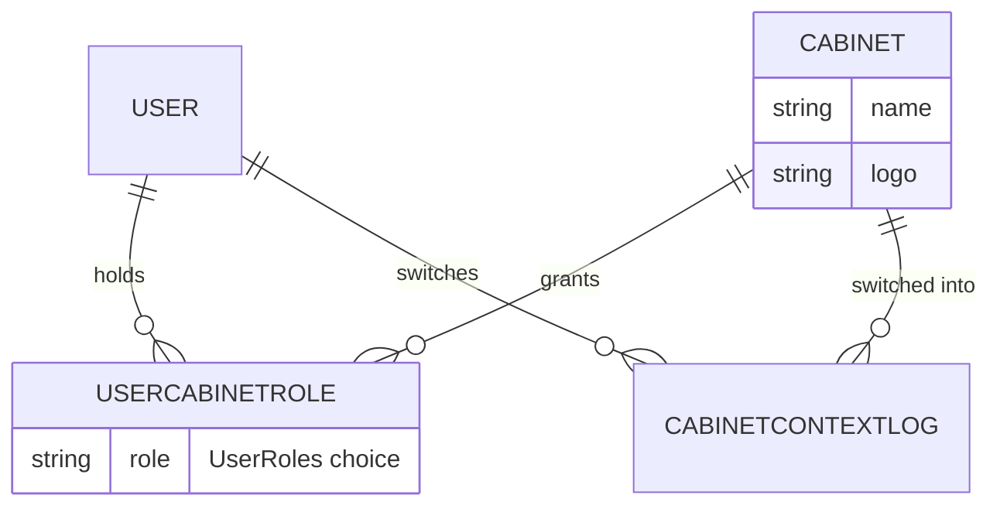
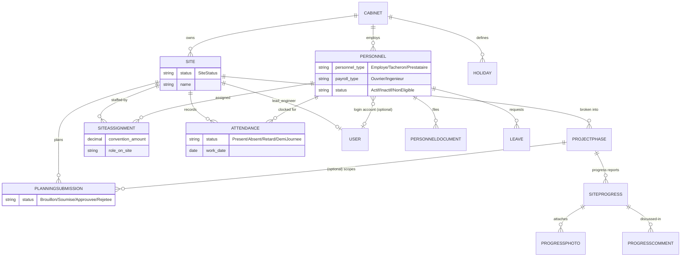
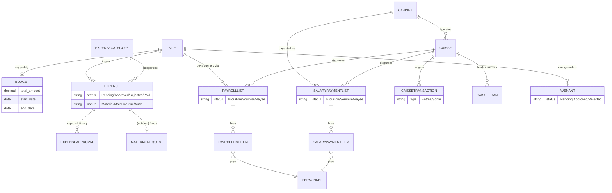
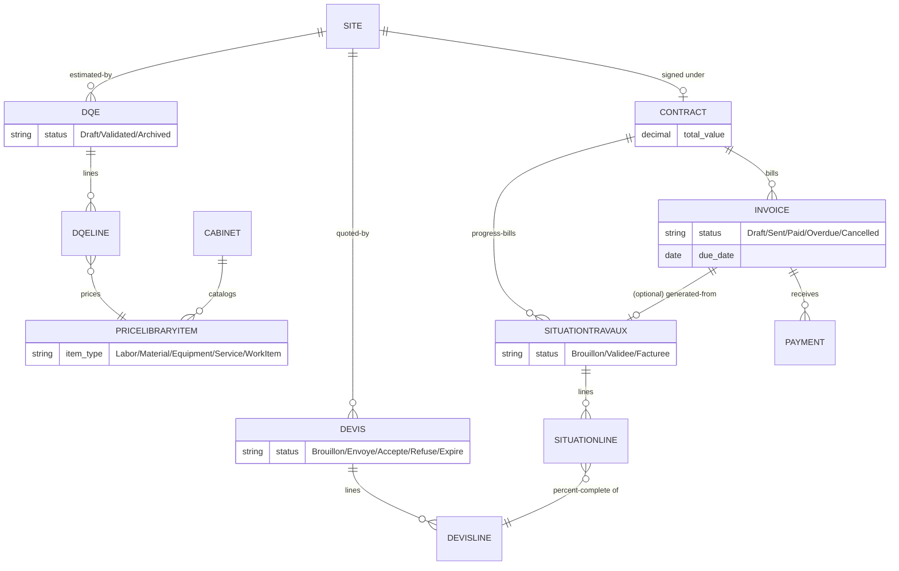
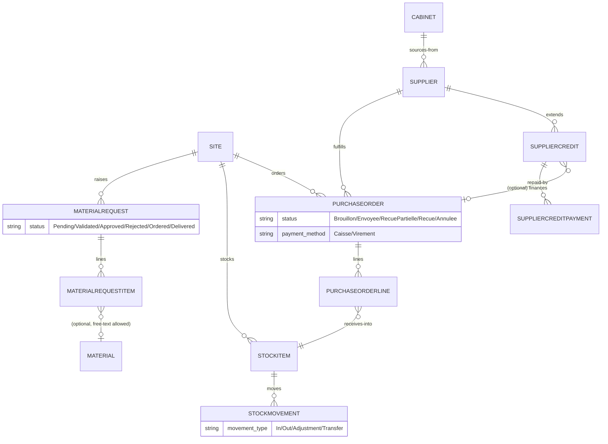
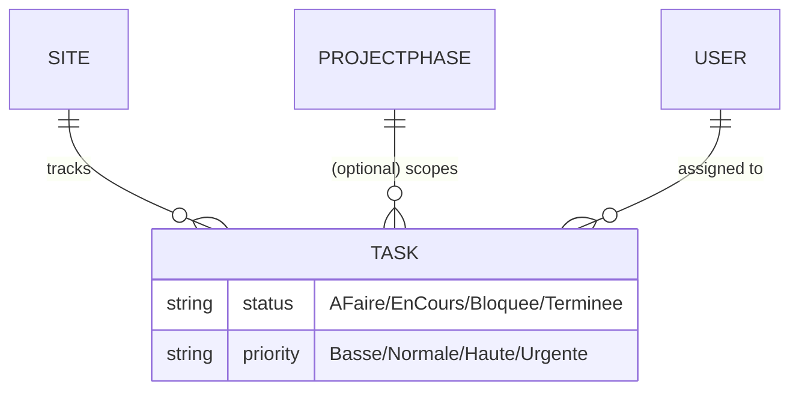

# Data Model

Split into five diagrams for readability — organizational core, projects/personnel,
finance, revenue/pricing, and procurement — rather than one dense graph. Every model
shown also inherits `core.models.BaseModel` (soft delete, audit fields, UUID) unless
noted otherwise; that's omitted below since it's uniform.

## Organizational core

A `UserCabinetRole` row is the entire authorization grant: `(user, cabinet, role)`. A
user with no row for a given Cabinet has zero access to it (barring superuser).

## Projects & Personnel

`Site` exposes computed properties (`total_spent`, `total_revenue`, `net_profit`,
`budget_usage_percentage`) that aggregate across the finance/revenue apps at read time
— these are not stored columns.

## Finance

Two payroll tracks are kept deliberately separate end-to-end — see
`PersonnelPayrollType` in `chantiermobile/constants.py` for the rationale: **ouvriers**
are paid progressively per-site through `PayrollList` (capped by
`SiteAssignment.convention_amount`); **ingénieurs/staff** are paid a fixed monthly
salary, not tied to a site, through `SalaryPaymentList`.

## Revenue & Pricing

## Procurement & Materials

`MaterialRequest` is a two-stage approval: a `MAGASINIER` validates it first
(`PENDING → VALIDATED`), then a director-tier role gives final authorization
(`VALIDATED → APPROVED`) — see `chantiermobile.constants.FINAL_AUTHORIZATION_ROLES`.
A `StockMovement` with `movement_type=TRANSFER` pairs two rows via `transfer_pair`
(one `OUT` of the source `StockItem`, one `IN` to the destination).

## Tasks (cross-cutting)

